#  Go PDF processor

It is a fork of [pdfcpu](https://github.com/pdfcpu/pdfcpu).

pdfcpu is a PDF processing library written in [Go](http://golang.org) supporting encryption.
It provides both an API and a CLI. Supported are all versions up to PDF 1.7 (ISO-32000).

Support for PDF 2.0 is basic and ongoing work.

## Motivation

This is an effort to build a comprehensive PDF processing library from the ground up written in Go. Over time pdfcpu aims to support the standard range of PDF processing features and also any interesting use cases that may present themselves along the way.

<p align="center">
  <kbd><a href="https://pdfcpu.io/generate/grid">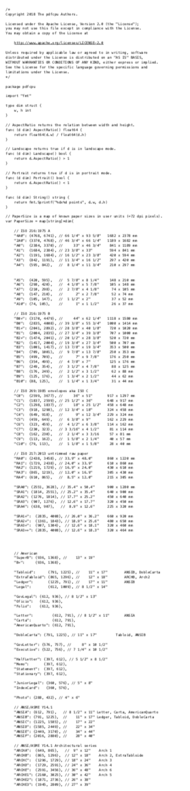</a></kbd>&nbsp;
  <kbd><a href="https://pdfcpu.io/core/watermark">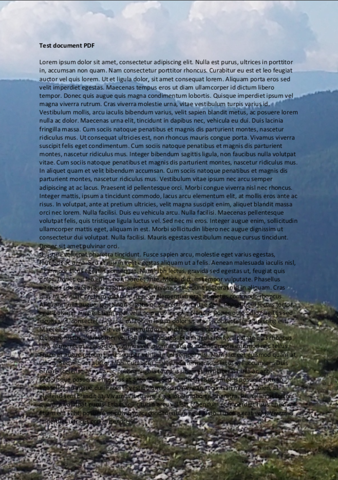</a></kbd>&nbsp;
  <kbd><a href="https://pdfcpu.io/generate/nup">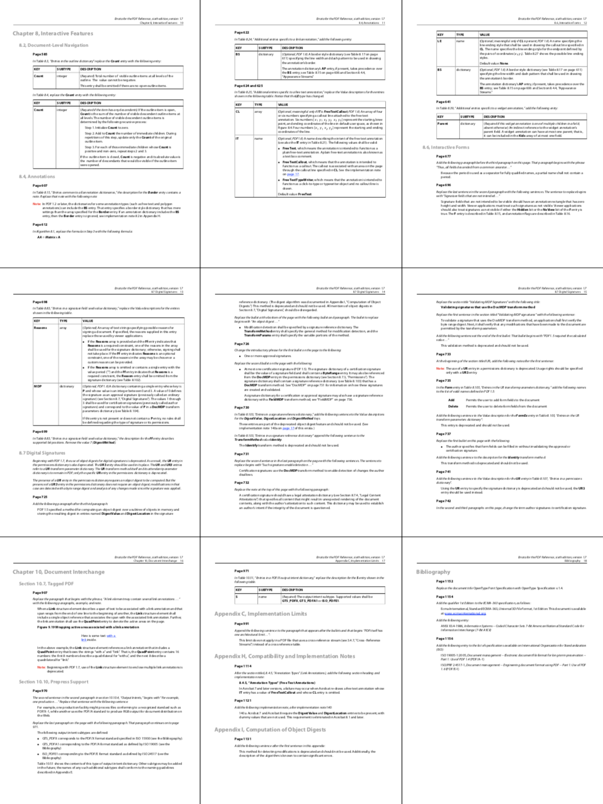</a></kbd>&nbsp;
  <kbd><a href="https://pdfcpu.io/fonts/fonts">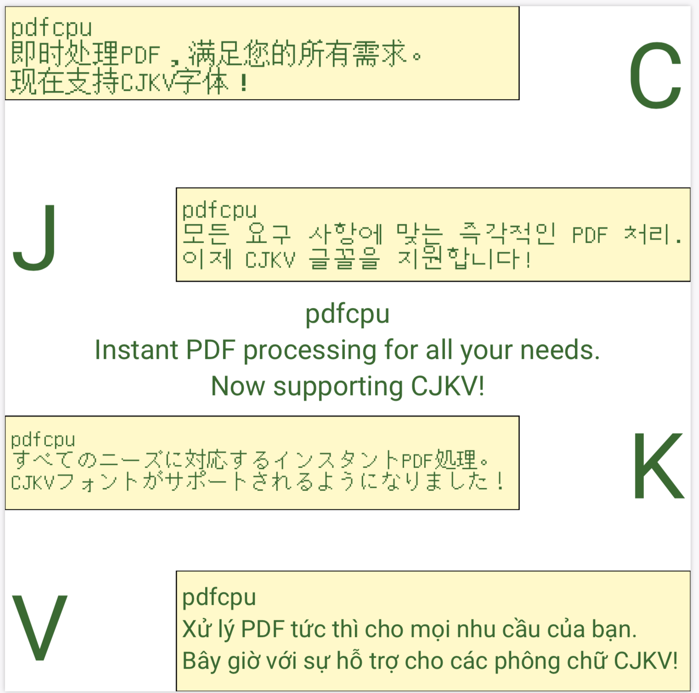</a></kbd>&nbsp;
  <kbd><a href="https://pdfcpu.io/core/stamp">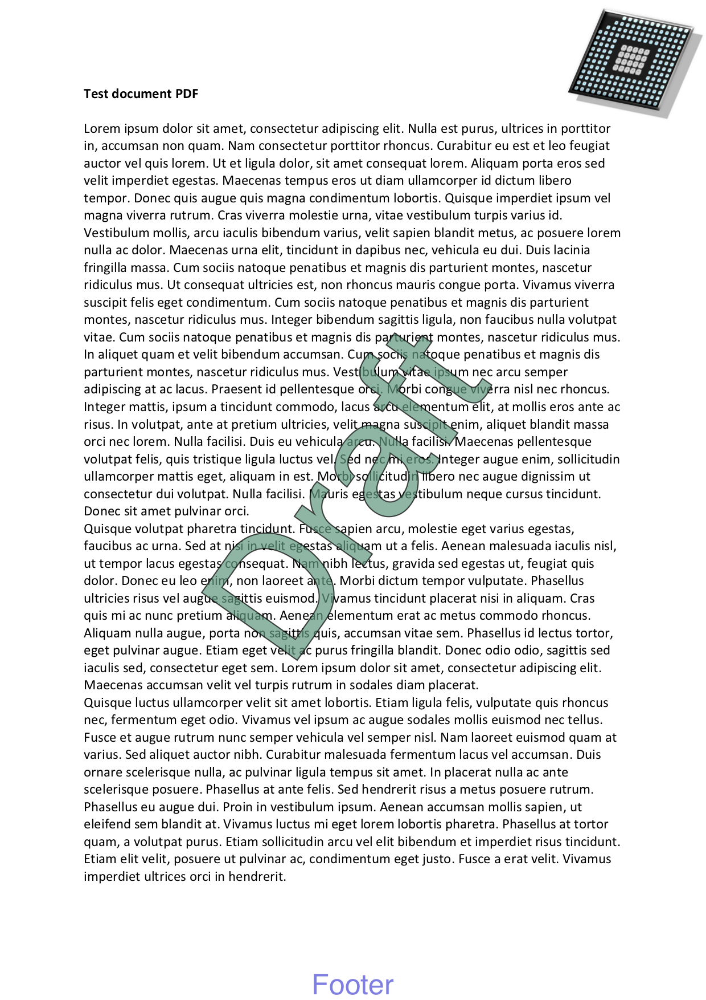</a></kbd>&nbsp;
  <kbd><a href="https://pdfcpu.io/form/form">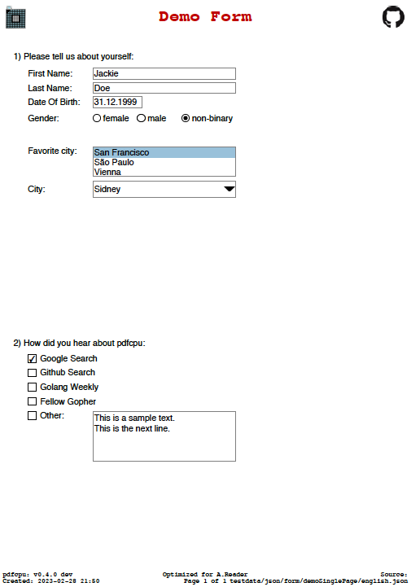</a></kbd><br><br>
  <kbd><a href="https://pdfcpu.io/generate/create">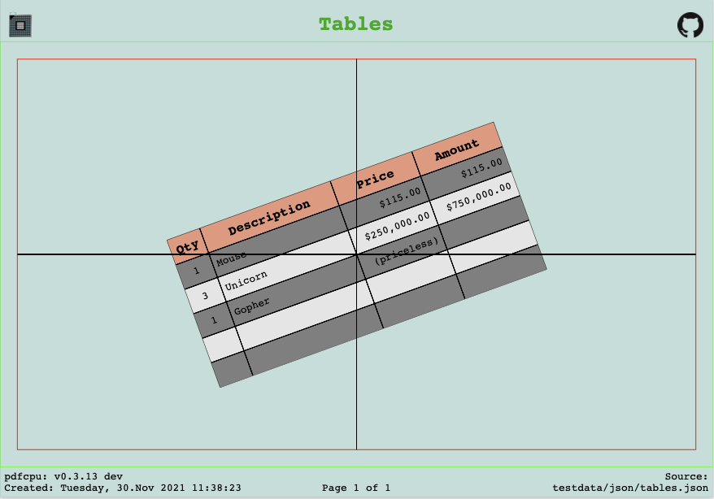</a></kbd>&nbsp;
  <kbd><a href="https://pdfcpu.io/core/stamp">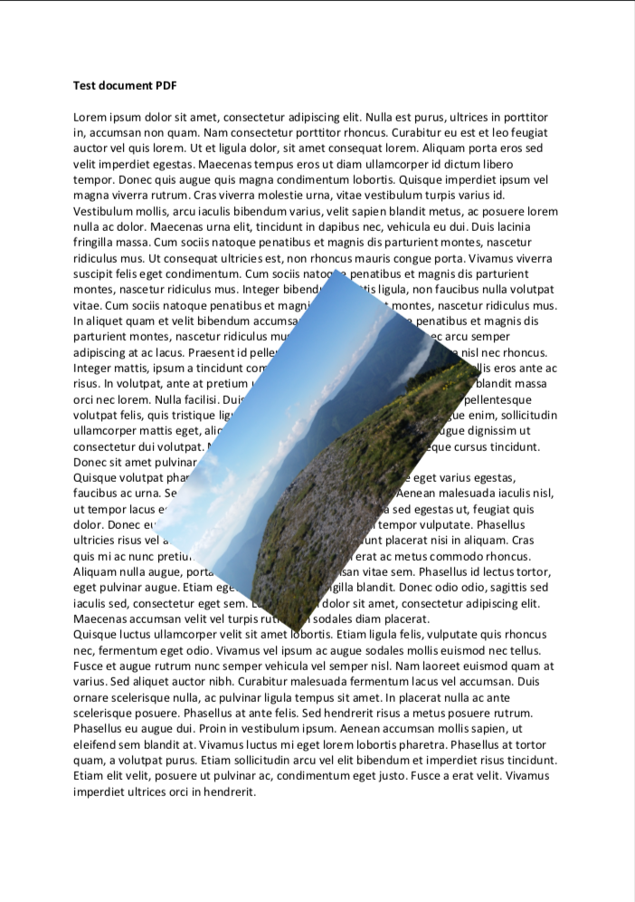</a></kbd>&nbsp;
  <kbd></kbd>&nbsp;
  <kbd><a href="https://pdfcpu.io/core/watermark">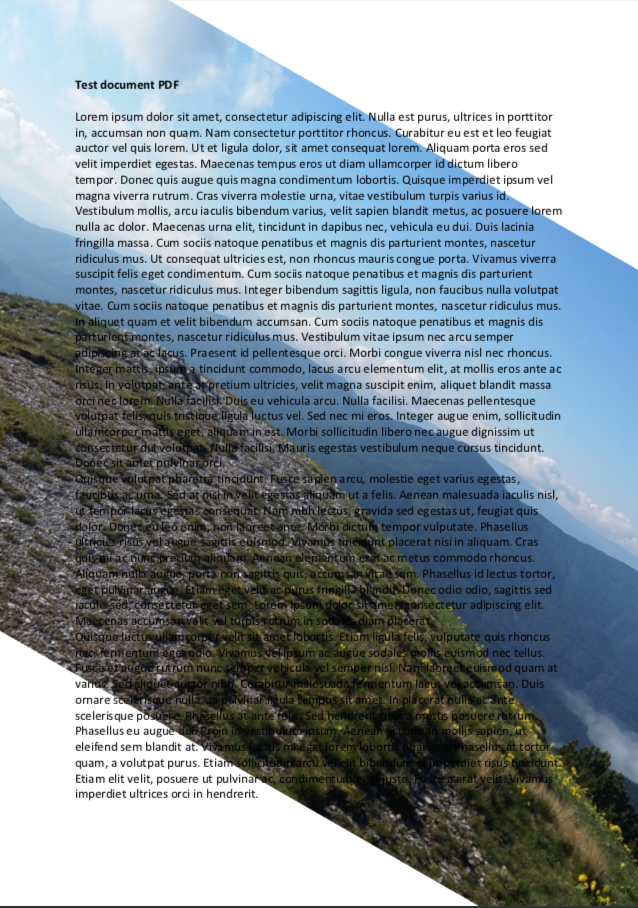</a></kbd>&nbsp;
  <kbd><a href="https://pdfcpu.io/generate/create">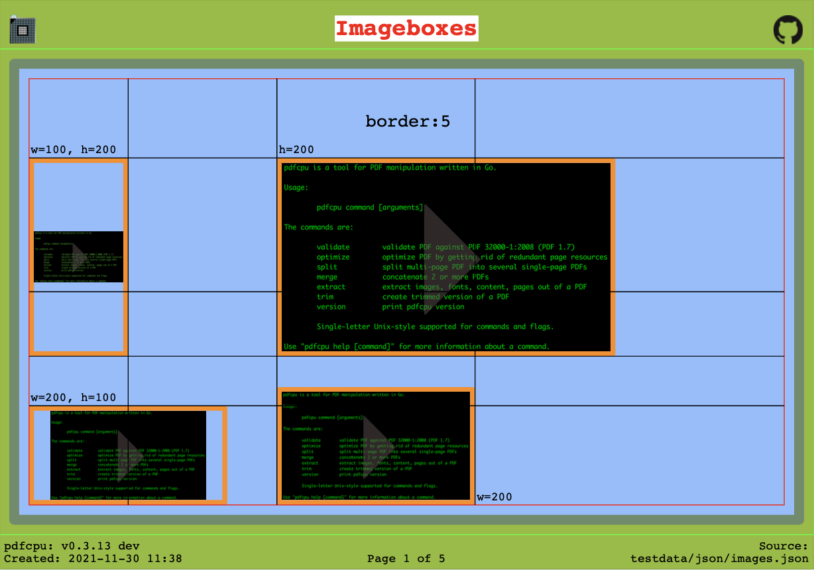</a></kbd>&nbsp;<br><br>
  <kbd><a href="https://pdfcpu.io/generate/booklet">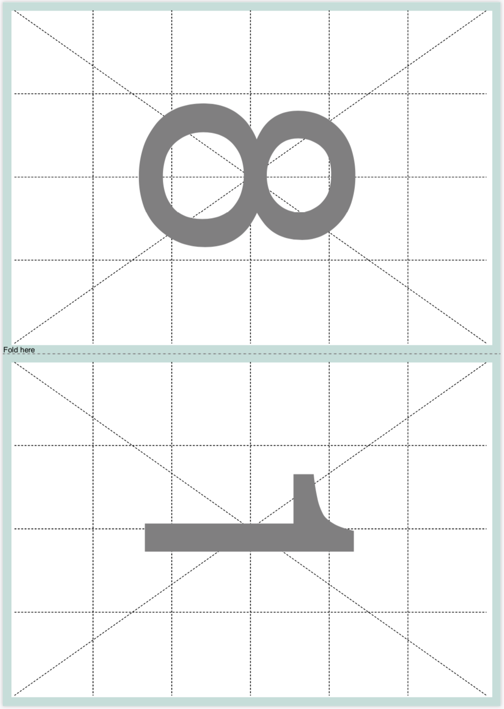</a></kbd>
  <kbd><a href="https://pdfcpu.io/core/stamp">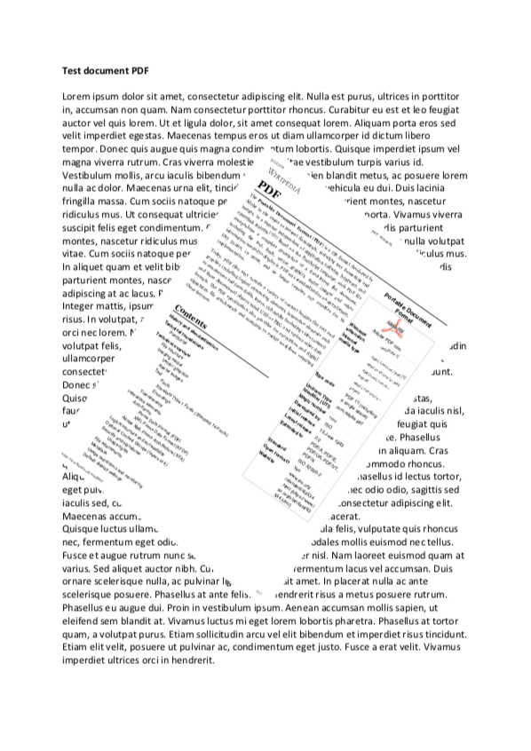</a></kbd>&nbsp;
  <kbd><a href="https://pdfcpu.io/generate/grid"></a></kbd>
  <kbd><a href="https://pdfcpu.io/core/stamp">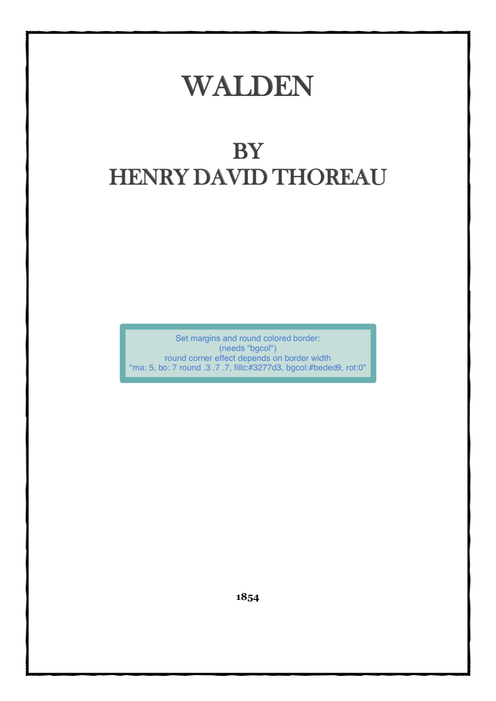</a></kbd>
  <kbd><a href="https://pdfcpu.io/generate/booklet"></a></kbd>
</p>

## Focus

The primary emphasis is on providing robust assistance for batch processing and scripting through a comprehensive command-line interface.
Simultaneously, pdfcpu aims to simplify the integration of PDF processing into your Go-based backend system by offering a versatile set of commands.

## Command Set

* [annotations](https://pdfcpu.io/annot/annot)
* [attachments](https://pdfcpu.io/attach/attach)
* [booklet](https://pdfcpu.io/generate/booklet)
* [bookmarks](https://pdfcpu.io/bookmarks/bookmarks)
* [boxes](https://pdfcpu.io/boxes/boxes)
* [change owner password](https://pdfcpu.io/encrypt/change_opw)
* [change user password](https://pdfcpu.io/encrypt/change_upw)
* [collect](https://pdfcpu.io/core/collect)
* [create](https://pdfcpu.io/generate/create)
* [crop](https://pdfcpu.io/core/crop)
* [cut](https://pdfcpu.io/generate/cut)
* [decrypt](https://pdfcpu.io/encrypt/decryptPDF)
* [encrypt](https://pdfcpu.io/encrypt/encryptPDF)
* [extract](https://pdfcpu.io/extract/extract)
* [fonts](https://pdfcpu.io/fonts/fonts)
* [form](https://pdfcpu.io/form/form)
* [grid](https://pdfcpu.io/generate/grid)
* [images](https://pdfcpu.io/images/images)
* [import](https://pdfcpu.io/generate/import)
* [info](https://pdfcpu.io/info)
* [keywords](https://pdfcpu.io/keywords/keywords)
* [merge](https://pdfcpu.io/core/merge)
* [ndown](https://pdfcpu.io/generate/ndown)
* [nup](https://pdfcpu.io/generate/nup)
* [optimize](https://pdfcpu.io/core/optimize)
* [pagelayout](https://pdfcpu.io/pagelayout/pagelayout)
* [pagemode](https://pdfcpu.io/pagemode/pagemode)
* [pages](https://pdfcpu.io/pages/pages)
* [permissions](https://pdfcpu.io/encrypt/perm_add)
* [portfolio](https://pdfcpu.io/portfolio/portfolio)
* [poster](https://pdfcpu.io/generate/poster)
* [properties](https://pdfcpu.io/properties/properties)
* [resize](https://pdfcpu.io/core/resize)
* [rotate](https://pdfcpu.io/core/rotate)
* [split](https://pdfcpu.io/core/split)
* [stamp](https://pdfcpu.io/core/stamp)
* [trim](https://pdfcpu.io/core/trim)
* [validate](https://pdfcpu.io/core/validate) 👉 now including rudimentory support for PDF 2.0
* [viewerpref](https://pdfcpu.io/viewerpref/viewerpref)
* [watermark](https://pdfcpu.io/core/watermark)
* [zoom](https://pdfcpu.io/core/zoom)

## Documentation

* The main entry point is [core.io](https://pdfcpu.io).
* For CLI examples also go to [core.io](https://pdfcpu.io). There you will find explanations of all the commands and their parameters.
* For API examples of all pdfcpu operations please refer to [GoDoc](https://pkg.go.dev/github.com/carmel/go-pdf/api).

### GoDoc

* [pdfcpu package](https://pkg.go.dev/github.com/carmel/go-pdf)
* [pdfcpu API](https://pkg.go.dev/github.com/carmel/go-pdf/api)
* [pdfcpu CLI](https://pkg.go.dev/github.com/carmel/go-pdf/pkg/cli)

## Reminder

* Always make sure your work is based on the latest commit!<br>
* pdfcpu is still *Alpha* - bugfixes are committed on the fly and will be mentioned in the next release notes.<br>
* Follow [pdfcpu](https://twitter.com/pdfcpu) for news and release announcements.
* For quick questions or discussions get in touch on the [Gopher Slack](https://invite.slack.golangbridge.org/) in the #pdfcpu channel.


## Contributing

### What

* Please [create](https://github.com/carmel/go-pdf/issues/new/choose) an issue if you find a bug or want to propose a change.
* Feature requests - always welcome!
* Bug fixes - always welcome!
* PRs - let's [discuss](https://github.com/carmel/go-pdf/discussions) first or [create](https://github.com/carmel/go-pdf/issues/new/choose) an issue.
* pdfcpu is stable but still *Alpha* and occasionally undergoing heavy changes.

### How

* The pdfcpu [discussion board](https://github.com/carmel/go-pdf/discussions) is open! Please engage in any form helpful for the community.
* If you want to report a bug please attach the *very verbose* (`pdfcpu cmd -vv ...`) output and ideally a test PDF that you can share.
* Always make sure your contribution is based on the latest commit.
* Please sign your commits.

### Reporting Crashes

Unfortunately crashes do happen :(
For the majority of the cases this is due to a diverse pool of PDF Writers out there and millions of PDF files using different versions waiting to be processed by core. Sometimes these PDFs were written more than 20(!) years ago. Often there is an issue with validation - sometimes a bug in the parser. Many times even using relaxed validation with pdfcpu does not work. In these cases we need to extend relaxed validation and for this we are relying on your help. By reporting crashes you are helping to improve the stability of core. If you happen to crash on any pdfcpu operation be it on the command line or in your Go backend these are the steps to report this:

Regardless of the pdfcpu operation, please start using the pdfcpu command line to validate your file:

``` sh
$ pdfcpu validate -v &> crash.log
```

 or to produce very verbose output

 ``` sh
 $ pdfcpu validate -vv &> crash.log
 ```

will produce what's needed to investigate a crash. Then open an issue and post `crash.log` or its contents. Ideally post a test PDF you can share to reproduce this. You can also email to hhrutter@gmail.com or if you prefer Slack you can get in touch on the Gopher slack #pdfcpu channel.

If processing your PDF with pdfcpu crashes during validation and can be opened by Adobe Reader and Mac Preview chances are we can extend relaxed validation and provide a fix. If the file in question cannot be opened by both Adobe Reader and Mac Preview we cannot help you!


## Code of Conduct

Please note that this project is released with a Contributor [Code of Conduct](CODE_OF_CONDUCT.md). By participating in this project you agree to abide by its terms.

